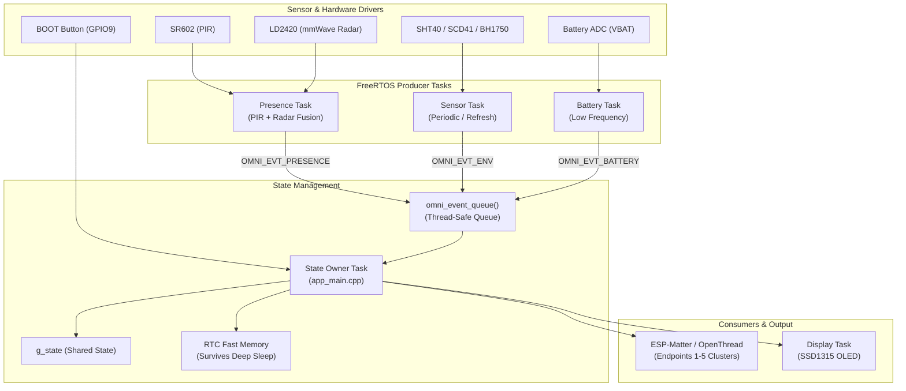

# Software Design & Architecture

**Engineering Documentation · OmniSensor Hub Firmware**  
Platform: Seeed Studio XIAO ESP32-C6 (Single-core RISC-V, 160 MHz)  
Operating System: FreeRTOS (ESP-IDF v5.4.3)  
Application Framework: ESP-Matter (Matter 1.3 / OpenThread)  
Device Role: Matter Sleepy End Device (SED) over Thread  

---

## 1. System Overview & Philosophy

OmniSensor operates as an ultra-low-power, multi-sensor environment and presence node. The software is engineered around three core constraints:

1. **Energy Scarcity:** The node is designed for battery operation. Sensors cannot stay continuously powered, and the ESP32-C6 must spend the vast majority of its life in deep sleep.
2. **Single-Core Concurrency:** The RISC-V core must run the high-priority OpenThread/Matter network stack alongside long sensor conversions (e.g. 5 seconds for the SCD41 CO₂ sensor), local display rendering, and UART radar frame parsing without tripping the Task Watchdog Timer (TWDT).
3. **Instantaneous UI Responsiveness:** When a user walks up to the device, the local OLED must display populated sensor readings in milliseconds rather than waiting 5 seconds for a sensor conversion or several seconds for network reconnection.



---

## 2. Concurrency Model: Actor / Single-Writer Pattern

### The Problem
On a single-core microcontroller, standard multi-threaded code that shares memory using mutexes is prone to priority inversion, high latency, and deadlocks. Furthermore, blocking transactions (such as the 5-second photoacoustic conversion of the Sensirion SCD41) would starve the network stack if executed in the wrong context.

### The Architecture
OmniSensor strictly adheres to a **single-writer actor pattern**:
* **Producers:** Sensor tasks, presence tasks, and battery tasks act exclusively as producers. They collect raw data, validate checksums (CRC-8), format an `omni_evt_t` structure, and push it onto the non-blocking FreeRTOS queue `omni_event_queue()`.
* **The Single Writer:** Exactly **one** task — the state owner in `firmware/hub/main/app_main.cpp` — reads from `omni_event_queue()`. It is the only entity permitted to write to `g_state` and push cluster attribute reports to the Matter data model.
* **Non-Blocking Ingress:** Calls to `omni_post_event()` never block longer than 1 FreeRTOS tick. If the queue is full under heavy load, the event is dropped and logged with `ESP_ERR_TIMEOUT`. A dropped measurement is vastly preferable to a stalled producer.

### Task Priority Hierarchy

All application task priorities sit strictly below the Matter/OpenThread stack:

| Priority | Task Name | Function | Rationale |
|---|---|---|---|
| **5+** | `Matter/OpenThread` | Mesh packet processing, crypto, network maintenance | Network packets must never be delayed by sensor tasks |
| **4** | `State Owner` (`app_main`) | Dequeues events, updates `g_state`, reports to Matter clusters | Highest application priority to promptly clear the event queue |
| **3** | `omni_sensor` | SHT40, SCD41, BH1750 sequencing | Runs long I²C transactions without starving the system |
| **3** | `omni_presence` | LD2420 UART parsing & PIR GPIO monitoring | Processes 24 GHz presence frames in real time |
| **3** | `omni_ui` | SSD1315 OLED rendering | Refreshes UI on state changes without blocking sensing |
| **2** | `omni_battery` | ADC multisampling & battery curve lookup | Runs rarely (every 10 minutes) at lowest priority |

---

## 3. Presence Sensing Subsystem (PIR + mmWave Fusion)

OmniSensor fuses two complementary technologies to eliminate the classic flaws of single-technology motion sensors:

```
  ┌───────────────┐               ┌────────────────┐
  │  SR602 (PIR)  │               │ LD2420 (Radar) │
  └───────┬───────┘               └───────┬────────┘
          │ Gross motion (< 10 ms)        │ Stationary breathing & range
          ▼                               ▼
     [Wake Trigger] ─────────────► [Qualifier / Gate Evaluator]
          │                               │
          └───────────────┬───────────────┘
                          ▼
             Fused Occupancy State & Zone
```

### 1. SR602 PIR (The Trigger)
* **Interface:** GPIO2 (`OMNI_PIN_PIR`), active HIGH.
* **Characteristics:** Extremely low quiescent current (< 20 µA), analog pyroelectric detection.
* **Role:** Instantaneous trigger (< 10 ms). When the device is in deep sleep, only the PIR (and the BOOT button) remains configured as an external wake-up source (`esp_sleep_enable_ext0_wakeup`). It awakens the ESP32-C6 when gross motion occurs.

### 2. HLK-LD2420 24 GHz Radar (The Qualifier)
* **Interface:** UART0 (TX GPIO16, RX GPIO17) running at 256,000 baud.
* **Power Control:** Switched rail `+3V3_SW` controlled via P-channel MOSFET `Q1` (GPIO21 / `OMNI_PIN_RAIL_EN`, active LOW).
* **Operation:**
  * When awake, the radar continuously emits 24 GHz FMCW signals and reports energy across multiple distance **gates** (each gate ≈ 0.70 m).
  * The firmware maps these gates into three distinct distance zones:
    * **Zone 1:** $< 0.7\text{ m}$ (At the device / desk interaction)
    * **Zone 2:** $0.7\text{ m} - 1.4\text{ m}$ (Near field)
    * **Zone 3:** $> 1.4\text{ m}$ (Room presence)
* **Why Fusion Matters:** A PIR cannot detect a human sitting still reading a book or working at a computer, leading to false "empty room" timeouts. The LD2420 detects micromovements down to breathing. The PIR wakes the system; the radar confirms presence and keeps occupancy active even when motionless.

---

## 4. Environmental Sensing Subsystem

The sensor task (`firmware/hub/main/sensor_task.c`) manages the shared I²C bus (`SDA` GPIO22, `SCL` GPIO23) using the modern ESP-IDF `driver/i2c_master.h` driver:

### 1. Sensirion SHT40 (Temperature & Humidity)
* **Address:** `0x44`
* **Operation:** High-precision mode (`0xFD`), takes ~8 ms conversion time.
* **Reliability:** 6-byte response (Temp MSB/LSB + CRC8, Humidity MSB/LSB + CRC8) verified against polynomial $0x31$ ($x^8 + x^5 + x^4 + 1$).

### 2. ROHM BH1750 (Ambient Light)
* **Address:** `0x23` (ADDR pin grounded).
* **Operation:** Continuously sampled or high-resolution one-shot mode (1 lx resolution, 120 ms integration).
* **Conversion:** Raw 16-bit count divided by 1.2 yields calibrated lux.

### 3. Sensirion SCD41 (Photoacoustic NDIR CO₂)
* **Address:** `0x62`
* **Current Profile:** Photoacoustic infrared heating pulses draw up to 200 mA peak.
* **Single-Shot Low-Power Mode:** Rather than running continuous measurement (~15–20 mA average), the firmware uses single-shot mode (`measure_single_shot`, command `0x219D`). The sensor measures for 5 seconds and returns results.
* **Bus Back-Powering Prevention:** To save power between readings, the SCD41 is issued a software `power_down` command (`0x36E0`) rather than disconnecting its power rail. An unpowered I²C chip sharing lines with an always-on bus would be back-powered through its internal ESD protection diodes, corrupting the bus.
* **Interval Bounding:** To prevent frequent motion wakes from flattening the battery via repeated 5-second CO₂ runs, the firmware enforces a 120-second cooldown (`OMNI_SCD41_MIN_INTERVAL_MS`).

---

## 5. Display & Fast-Wake UI (SSD1315 OLED)

* **Interface:** I²C `0x3C`, 128×64 monochrome OLED.
* **Rail:** Maintained on the always-on rail `+3V3_AO`.

### RTC Fast-Wake State Restoration
When waking from deep sleep, the ESP32-C6 performs a software reset and re-executes `app_main`. Without optimization, the display would remain blank for up to 5 seconds while the SCD41 completes conversion.

To solve this:
1. Prior to deep sleep, the state owner copies the last valid sensor readings into RTC Slow Memory using the `RTC_DATA_ATTR` attribute.
2. Immediately upon boot — while FreeRTOS is starting and before the network stack or sensors initialise — `display.c` reads the RTC cache and paints the screen in under **50 ms**.
3. The user sees populated numbers instantly upon walking up to the device.

---

## 6. Power Management & Battery ADC

### Battery Voltage Sensing (`power.c`)
The battery divider consists of two 100 kΩ 1% resistors connected directly to `VBAT`.
* **ADC Configuration:** ESP32-C6 ADC1 Channel 0 (GPIO0 / `OMNI_PIN_BATT_SENSE`) configured with $-12\text{ dB}$ attenuation ($0 - 3.3\text{ V}$ range).
* **Noise Mitigation:** RF transmission produces electromagnetic coupling onto high-impedance ADC lines. The battery sampling routine runs **immediately after wake and before the Thread radio is started**.
* **Multisampling & Calibration:** Takes 32–64 samples, applies factory eFuse calibration via `esp_adc_cal`, and averages.
* **Discharge Curve:** Translates calibrated millivolts ($3.0\text{ V} - 4.2\text{ V}$) to state-of-charge percentage via an empirical LiPo discharge lookup table (`k_batt_curve`).

### Light Sleep Lock Management
During active bus transfers, ESP-IDF's automatic light sleep can shut down peripheral clocks, truncating I²C and UART bytes. The firmware implements reference-counted sleep holds via `omni_stay_awake(bool hold)`.

---

## 7. Matter over Thread Integration

The device integrates with the **ESP-Matter SDK** (built on the official CSA Matter specification):

### Matter Data Model & Cluster Mapping

| Endpoint | Cluster | Device Type | Reported Attributes |
|---|---|---|---|
| **0** | Basic Information, Thread Network Diagnostics, General Commissioning | Root Node | Device Name, Vendor ID, Product ID, Firmware Version |
| **1** | Temperature Measurement (`0x0402`) | Temperature Sensor | `MeasuredValue` (scaled $0.01^\circ\text{C}$) |
| **2** | Relative Humidity Measurement (`0x0405`) | Humidity Sensor | `MeasuredValue` (scaled $0.01\%$) |
| **3** | Illuminance Measurement (`0x0400`) | Light Sensor | `MeasuredValue` ($10000 \times \log_{10}(\text{lux}) + 1$) |
| **4** | Carbon Dioxide Concentration (`0x040D`) | Air Quality / CO₂ | `MeasuredValue` (parts per million ppm) |
| **5** | Occupancy Sensing (`0x0406`) | Occupancy Sensor | `Occupancy` (Bitmap / Boolean presence) |

### On-Board BOOT Button (GPIO9)
The XIAO's built-in BOOT button handles dual roles:
* **Short Press (< 2 s):** Wakes the UI and triggers an immediate sensor refresh.
* **Long Press (> 5 s):** Initiates a Matter factory reset, clearing Thread network credentials and entering commissioning mode.

---

## 8. Standalone Validation Suite (`firmware/examples/`)

During Milestone 1, each sensor driver was developed and verified in isolation under `firmware/examples/` before being integrated into `firmware/hub/`. Every example is a self-contained ESP-IDF project:

| Example Project | Focus & Validation Criteria |
|---|---|
| `firmware/examples/sht40` | I²C communication at `0x44`, high-precision read, CRC-8 validation. |
| `firmware/examples/bh1750` | Lux calculation, integration time adjustment, bus compatibility. |
| `firmware/examples/scd41` | Photoacoustic single-shot timing, `power_down` command, rail droop check. |
| `firmware/examples/ld2420` | High-speed UART at 256k baud, binary frame parsing, gate energy detection. |
| `firmware/examples/sr602` | GPIO2 interrupt latency, low-power ext0 wake-up verification. |
| `firmware/examples/ssd1315` | I²C display initialization, 128×64 frame buffer, custom typography rendering. |
| `firmware/examples/all` | Simultaneous bus integration, RTC memory persistence across deep sleep. |

---

## 9. Development Environment & Setup Guide

### 1. Prerequisites

#### macOS
```bash
brew install cmake ninja dfu-util ccache python
```

#### Debian / Ubuntu / WSL2
```bash
sudo apt-get update
sudo apt-get install -y git wget flex bison gperf python3 python3-pip python3-venv \
                        cmake ninja-build ccache libffi-dev libssl-dev dfu-util libusb-1.0-0
```

### 2. Install ESP-IDF v5.4.3

```bash
mkdir -p ~/esp
cd ~/esp
git clone -b v5.4.3 --recursive https://github.com/espressif/esp-idf.git
cd esp-idf
./install.sh esp32c6
```

### 3. Install the ESP-Matter SDK (Required for `firmware/hub/`)

```bash
cd ~/esp
git clone --depth 1 https://github.com/espressif/esp-matter.git
cd esp-matter
git submodule update --init --depth 1
cd ./connectedhomeip/connectedhomeip
./scripts/checkout_submodules.py --platform esp32 linux --shallow
cd ../..
./install.sh --no-host-tool
```

### 4. Configure Shell Aliases
Add these aliases to `~/.bashrc` or `~/.zshrc`:

```bash
alias get_idf='export IDF_CCACHE_ENABLE=1 && source ~/esp/esp-idf/export.sh'
alias get_matter='get_idf && source ~/esp/esp-matter/export.sh'
```

### 5. Building & Flashing

#### Standalone Examples (ESP-IDF only):
```bash
get_idf
cd firmware/examples/sht40
idf.py set-target esp32c6
idf.py build flash monitor
```

#### Integrated Hub Firmware (ESP-Matter):
```bash
get_matter
cd firmware/hub
idf.py set-target esp32c6
idf.py build flash monitor
```

### 6. Matter Commissioning (Home Assistant / Apple Home)
1. Ensure your local network has an active **Thread Border Router** (e.g. Home Assistant Yellow/SkyConnect, Apple TV 4K, HomePod mini).
2. Run `idf.py monitor` on the hub firmware. The console will display the Matter QR-code link and manual pairing code.
3. In Home Assistant, navigate to **Settings → Devices & Services → Add Integration → Matter (Thread)**, scan the QR code, and complete commissioning.
