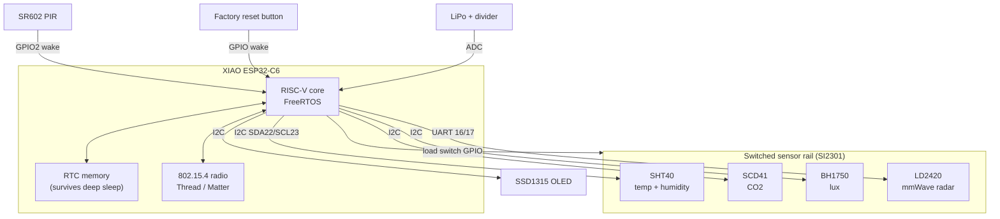

# OmniSensor — Project Description

**A battery-powered, multi-zone presence and air-quality sensor for Matter over Thread.**

| | |
|---|---|
| **Platform** | Seeed Studio XIAO ESP32-C6 (single-core RISC-V, Wi-Fi 6, 802.15.4) |
| **Protocol** | Matter over Thread, operating as a Sleepy End Device (SED) |
| **Toolchain** | ESP-IDF v5.4.3 + ESP-Matter SDK, target `esp32c6` |
| **Author** | Mirko Pica |
| **License** | MIT |
| **Deadline** | 31 August 2026 |

---

## 1. Abstract

Most commercial occupancy sensors answer a single yes/no question: is anyone in the room? OmniSensor
answers a more useful one — *where* in the room, and *what is the air like there*. It fuses a PIR motion
sensor with a 24 GHz mmWave presence radar to divide the space in front of it into 0.7 m distance bands,
and it pairs that with a CO₂, temperature, humidity and illuminance sensor package. Everything is exposed
to any Matter controller over a Thread mesh, and a small OLED shows the live readings locally.

The engineering challenge is not the sensing — it is doing all of this on a battery. A CO₂ sensor alone
can pull tens of milliamps while measuring. OmniSensor therefore spends nearly all of its life in deep
sleep with the entire sensor rail physically disconnected by a load switch, targeting a sleep current in
the **single-digit microamps**, and wakes within milliseconds when the PIR fires.

## 2. Goals

### Functional

- Report temperature, relative humidity, CO₂ concentration and illuminance as standard Matter clusters.
- Report occupancy, resolved into three distance zones rather than a single boolean.
- Wake instantly on physical presence and push an unsolicited update to the Thread network.
- Display current readings on a local OLED without requiring a phone or hub.
- Commission into Apple Home and Home Assistant using standard Matter flows.
- Provide a physical button for the Matter-mandated factory reset.

### Non-functional

- Deep-sleep current low enough for a multi-month battery life on a single LiPo cell.
- Temperature and humidity readings unpolluted by self-heating from the radio.
- No data races on state shared between the sensing, UI and network tasks.
- UI must appear populated *immediately* on wake, not after the 5 s CO₂ measurement completes.

## 3. System architecture



Note that the OLED sits on the *always-on* rail, not the switched one, so the display can be refreshed
from RTC memory before the sensors have even powered up.

## 4. Bill of materials

| Part | Function | Interface | Address / Pin | Notes |
|---|---|---|---|---|
| Seeed XIAO ESP32-C6 | MCU, Wi-Fi 6 + Thread | — | — | Single-core RISC-V; on-board LiPo charger |
| Sensirion SHT40 | Temperature + humidity | I²C | `0x44` | ±0.2 °C; CRC-8 checked |
| Sensirion SCD41 | CO₂ (+ T/RH) | I²C | `0x62` | Photoacoustic NDIR; ~5 s single-shot; high inrush |
| ROHM BH1750 | Ambient light | I²C | `0x23` | ADDR to GND; 120 ms high-res conversion |
| SSD1315 | 128×64 OLED | I²C | `0x3C` | SSD1306-compatible command set |
| Hi-Link LD2420 | 24 GHz mmWave presence | UART | TX 16 / RX 17 | Gate-based distance reporting |
| SR602 | PIR motion | GPIO | `GPIO_NUM_2` | Deep-sleep wake source; needs Fresnel lens |
| Vishay SI2301 | P-MOSFET load switch | GPIO | TBD | Cuts the sensor rail during sleep |
| 2× 100 kΩ, 1× 100 nF | Battery ADC divider | ADC | TBD | See §7 |
| 100 µF+ | Switched-rail bulk cap | — | — | Absorbs SCD41 inrush at rail turn-on |

## 5. Pin map

| Signal | XIAO pin | Direction | Notes |
|---|---|---|---|
| I²C SDA | 22 | bidir | Shared by SHT40, SCD41, BH1750, SSD1315 |
| I²C SCL | 23 | out | 100 kHz for sensors, 400 kHz for the OLED |
| Radar UART TX | 16 | out | See the open question in §17 |
| Radar UART RX | 17 | in | |
| PIR | `GPIO_NUM_2` | in, pull-down | Deep-sleep wake, active HIGH |
| Sensor rail enable | TBD | out | Active LOW (P-MOSFET gate), external pull-up |
| Battery sense | TBD | analog | ADC1, −12 dB attenuation |
| Factory reset button | TBD | in, pull-up | Long-press; also a wake source |

## 6. Power management

The device operates as a **Matter Sleepy End Device**. The Thread radio is off for the vast majority of
the time, waking periodically to poll its parent router for queued messages. Two things break that
rhythm: a presence event from the PIR or radar, or a physical button press. Both are GPIO wake sources
that trigger an immediate wake and an unsolicited attribute report, so the network sees presence with no
polling latency.

### Load switching

Even in deep sleep, the sensors themselves would dominate the power budget — the SCD41 in particular. A
**SI2301 P-channel MOSFET** therefore cuts power to the entire sensor rail (SHT40, SCD41, BH1750, LD2420)
whenever the device sleeps.

The gate is held by an **external pull-up resistor**, which is a deliberate safety choice: a P-MOSFET
with its gate pulled to the source voltage is *off*. If the ESP32-C6 control pin floats — during boot,
after a firmware crash, or throughout deep sleep when GPIO drivers are powered down — the sensor rail
defaults to **off** rather than silently draining the battery. Failure modes should fail toward low
power, not away from it.

A bulk capacitor of **100 µF or more** sits on the switched rail. When the MOSFET turns on, the SCD41
draws a substantial inrush current; without local bulk the rail would sag far enough to brown out the
other I²C devices sharing it.

### Wake sequence

1. GPIO wake fires. The ESP32-C6 performs a software reset and re-enters `app_main`.
2. Still single-threaded, before the FreeRTOS scheduler matters, the last known readings are pulled from
   RTC memory and pushed straight to the OLED. The user sees data immediately.
3. The sensor rail is switched on and the staggered warm-up begins.
4. The battery ADC is sampled — deliberately *before* the Thread radio comes up (see §7).
5. Tasks start, sensors are read, RTC memory and the OLED are refreshed, Matter attributes are reported.
6. After an inactivity timeout with no presence, the OLED is put to sleep, the rail is cut, and the
   device returns to deep sleep.

## 7. Battery monitoring

A resistive divider of **two 100 kΩ resistors** in series (V<sub>batt</sub> → ADC pin → GND) halves the
cell voltage. The value is chosen for leakage, not accuracy: at a full 4.2 V the divider bleeds only
about **21 µA**, which is the same order as the target sleep current and therefore acceptable. Lower
resistances would measure marginally better and cost far more current.

A **100 nF capacitor** across the low-side resistor gives the ADC's sample-and-hold something to charge
from. The ESP32-C6's ADC input impedance is high enough that, driven directly by a 50 kΩ Thévenin source,
the sampled value would read low.

The ADC runs at **−12 dB attenuation**, giving a usable range up to roughly 3.1 V. With the divider
halving 4.2 V down to 2.1 V, readings land in the middle of the ADC's most linear region rather than
against either rail. Calibration uses **`esp_adc_cal`**, which reads the per-chip correction values
Espressif burns into the eFuses at manufacture.

Sampling takes an **average of 32–64 readings**, performed immediately after wake and **before the Thread
radio is enabled**. RF activity couples measurable noise onto the ADC; sampling first sidesteps it
entirely rather than trying to filter it out afterwards.

## 8. Firmware architecture

The ESP32-C6 is single-core, so task priorities are a real design constraint rather than a formality.

| Task | Priority | Responsibility |
|---|---|---|
| Matter / Thread stack | High | Network stack, commissioning, attribute reporting |
| Sensor task | Medium-low | Sequenced I²C reads, radar UART parsing |
| UI task | Medium-low | OLED rendering |
| Battery task | Low | Periodic ADC sampling, multisampling average |

Sensor, UI and battery work runs **below** the Matter stack. The sensor path in particular contains long
blocking waits — the SCD41 needs roughly 5 s for a single-shot measurement — and running that at or above
the network priority would starve the stack and trip the Task Watchdog Timer.

### Shared state

Readings live in `RTC_DATA_ATTR` variables so they survive deep sleep. This is what makes the instant-UI
behaviour possible: on wake, `app_main` reads them while still effectively single-threaded, before task
concurrency exists, so no locking is needed at that point.

Once the scheduler is running, concurrency is real. The chosen approach is a **single writer**: sensor
and battery tasks publish readings onto a FreeRTOS queue, and one owner task performs every write to
shared state. This eliminates the deadlock question rather than managing it. Where a mutex is genuinely
needed instead, it is taken with a timeout — never `portMAX_DELAY` — so a stall degrades into a logged
error rather than a silent hang.

## 9. Presence detection

### Zone logic

The LD2420 reports detection strength per distance **gate**. Gates are grouped into 0.7 m bands:

| Zone | Distance | Intended meaning |
|---|---|---|
| Zone 1 | < 0.7 m | At the device — someone is interacting with it |
| Zone 2 | 0.7 – 1.4 m | Near field — seated at a desk, standing nearby |
| Zone 3 | > 1.4 m | Room presence — someone is in the space |

Each gate needs its own sensitivity threshold, since return strength falls off sharply with distance. A
calibration routine (Milestone 3) tunes these against an empty room.

### Sensor fusion

The two presence sensors do different jobs and are not redundant:

- **PIR (SR602)** — detects *motion*, draws almost nothing, and can wake the MCU from deep sleep via
  GPIO. It is the trigger.
- **mmWave (LD2420)** — detects *presence* including a stationary person, and reports distance. It needs
  the sensor rail powered and a UART running, so it cannot be the wake source. It is the qualifier.

The PIR wakes the device; the radar then decides which zone is occupied and holds occupancy true while a
motionless person remains in the room — the classic case a PIR alone gets wrong.

## 10. Matter integration

Sensor data maps onto standard Matter clusters, handled natively by the ESP-Matter SDK:

| Measurement | Matter cluster |
|---|---|
| Temperature | Temperature Measurement |
| Relative humidity | Relative Humidity Measurement |
| CO₂ | Carbon Dioxide Concentration Measurement |
| Illuminance | Illuminance Measurement |
| Presence | Occupancy Sensing |
| Battery | Power Source |

Using standard clusters means Apple Home and Home Assistant get the device working with no custom
integration code. Zone information beyond the boolean occupancy state has no standard cluster and is an
open design question (§17).

Commissioning follows the normal Matter flow over Thread, which requires an existing Thread Border Router
on the network (an Apple TV, HomePod, or a Home Assistant SkyConnect/Yellow). A **long press** on the
physical button performs the Matter-mandated factory reset, clearing fabric credentials.

## 11. Display and UI

The current implementation drives the SSD1315 directly over I²C with a hand-rolled 5×7 bitmap font — no
graphics library — writing page-addressed rows for temperature, humidity, CO₂, lux and radar distance.
It is deliberately minimal: the OLED must be initialised and drawn *before* the sensors have warmed up.

Milestone 3 replaces this with proportional fonts and small icons per measurement, plus an explicit
"updating" state so a stale RTC-memory reading is never mistaken for a live one.

## 12. Hardware realisation

The project ships **two distinct hardware artifacts**, and the distinction matters when reading this
repository:

### PCB — designed, not fabricated

A complete **Altium Designer** project (schematic, layout, gerber and PDF exports) lives in
[hardware/](hardware/). It is a finished design deliverable, but **no board was ever ordered** — there
was not enough time in the schedule for fabrication and shipping. Design decisions captured there:

- **Thermal isolation.** The XIAO module is the dominant heat source on the board, and the SHT40 and
  SCD41 sit right next to it. Both are physically separated from the module, with milled slots and copper
  relief in the pour around them to break the conduction path. A temperature sensor reading the radio's
  waste heat is worse than no temperature sensor.
- **External I²C pull-ups.** The examples currently rely on the ESP32-C6's internal pull-ups, which are
  weak (tens of kΩ) and marginal for a four-device bus. The PCB specifies proper external resistors.
- **Decoupling.** Local ceramics per device, plus the 100 µF+ bulk cap on the switched rail.
- A PDF export of the schematic is committed alongside the source so it can be reviewed without an
  Altium licence.

### Wired prototype — built and measured

The unit that actually runs is **hand-wired with cables**, and it includes the SI2301 load switch and the
battery divider on protoboard. This matters: it means the deep-sleep current and the battery gauge are
**measured results** rather than datasheet arithmetic. The wiring table and photographs live in
[hardware/prototype/](hardware/prototype/).

## 13. Enclosure

A 3D-printed case houses the wired prototype. Three constraints drive the design:

- **PIR Fresnel lens.** The SR602's lens must sit at its designed focal distance from the pyroelectric
  element. Mount it wrong and detection range collapses. A dedicated holder enforces the spacing.
- **mmWave mounting.** The LD2420 is mounted flush with the case wall. Any plastic in the beam path
  produces internal reflections, which the radar reports as phantom targets — ghosting that would corrupt
  the zone logic.
- **SCD41 airflow.** A CO₂ sensor in a sealed box measures the box. Vents provide genuine air exchange
  with the room, positioned so convection from the XIAO does not draw warm air across the SHT40.

Because the internals are cabled rather than a flat PCBA, the enclosure volume is sized for wiring.

## 14. Repository layout

```
OmniSensor/
├─ firmware/
│  ├─ hub/                  # integrated OmniSensor firmware (Milestones 2-3)
│  └─ examples/             # standalone per-sensor validation projects (Milestone 1)
│     ├─ sr602/ sht40/ bh1750/ scd41/ ld2420/ ssd1315/
│     └─ all/               # all seven integrated, with RTC fast-wake UI
├─ hardware/
│  ├─ altium/               # .PrjPcb, .SchDoc, .PcbDoc, libraries
│  ├─ gerbers/              # fabrication export (committed deliverable)
│  ├─ pdf/                  # schematic PDF, readable without Altium
│  ├─ prototype/            # wiring table + photos of the built unit
│  └─ datasheets/
├─ enclosure/
│  ├─ cad/                  # source model
│  └─ stl/                  # printable meshes
└─ docs/
   ├─ SETUP.md
   ├─ HARDWARE_DESIGN.md
   └─ MILESTONES.md
```

Every example under `firmware/examples/` is an independent ESP-IDF project with its own
`CMakeLists.txt`, `main/` component and `sdkconfig.defaults` pinning `CONFIG_IDF_TARGET="esp32c6"`.

## 15. Toolchain

**ESP-IDF v5.4.3** with the **ESP-Matter SDK**, targeting `esp32c6`. The firmware uses the modern
`driver/i2c_master.h` bus API rather than the deprecated `driver/i2c.h`, so it will not compile against
IDF versions older than 5.2. Full installation instructions are in [docs/SETUP.md](docs/SETUP.md).

## 16. Status

Milestone 1 is complete: all seven devices have standalone drivers, the I²C bus has been verified free of
address conflicts, and the radar UART link is working. The `all` example demonstrates every sensor
running together with RTC-memory fast wake.

Remaining work is tracked in [docs/MILESTONES.md](docs/MILESTONES.md), due **31 August 2026**.

## 17. Known gaps and open decisions

These are unresolved and deliberately recorded rather than hidden:

1. **UART0 conflict — the most significant open issue.** Both `ld2420` and `all` configure the radar on
   `UART_NUM_0`, pins 16/17. UART0 is also the default ESP-IDF log console. This works today only because
   the XIAO logs over its native USB-Serial/JTAG peripheral instead, but it is fragile: any build that
   routes the console back to UART0 will interleave log output with radar traffic and corrupt both.
   Moving the radar to `UART_NUM_1` is the correct fix and is scheduled for Milestone 2.
2. **Unassigned GPIOs.** The load-switch enable, battery sense and factory-reset button pins are still
   TBD, pending the pin budget in the Altium schematic.
3. **I²C pull-up values.** External pull-ups are specified but not yet valued; depends on final bus
   capacitance with four devices and cable runs.
4. **Zone reporting over Matter.** Occupancy Sensing carries a boolean. How to expose three distance
   zones — multiple endpoints, or a manufacturer-specific cluster — is undecided.
5. **Sleep current is a target, not yet a measurement.** The ~7–10 µA figure is a design goal derived
   from datasheets. Measuring it on the wired prototype is an explicit Milestone 2 task.
6. **SCD41 duty cycle.** A 5 s single-shot measurement on every presence wake may be too expensive if
   wakes are frequent. A minimum interval between CO₂ measurements probably needs to be enforced.

## 18. References

- [Seeed Studio XIAO ESP32-C6 Wiki](https://wiki.seeedstudio.com/xiao_esp32c6_getting_started/)
- [ESP-IDF v5.4.3 Programming Guide (ESP32-C6)](https://docs.espressif.com/projects/esp-idf/en/v5.4.3/esp32c6/)
- [ESP-Matter SDK Documentation](https://docs.espressif.com/projects/esp-matter/en/latest/esp32/)
- [Matter Specification — Connectivity Standards Alliance](https://csa-iot.org/all-solutions/matter/)
- Sensirion SHT4x datasheet · Sensirion SCD4x datasheet · ROHM BH1750FVI datasheet
- Solomon Systech SSD1315 datasheet · Hi-Link LD2420 user manual · Vishay SI2301 datasheet
